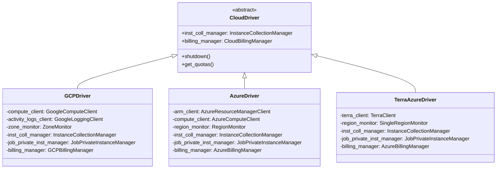
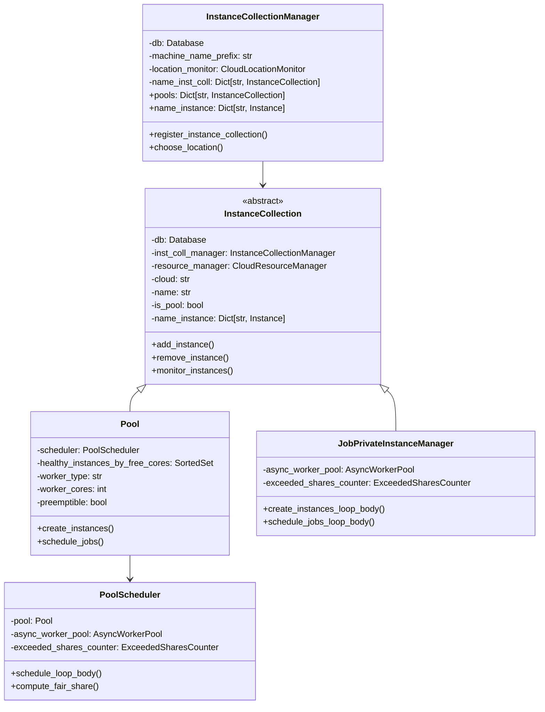
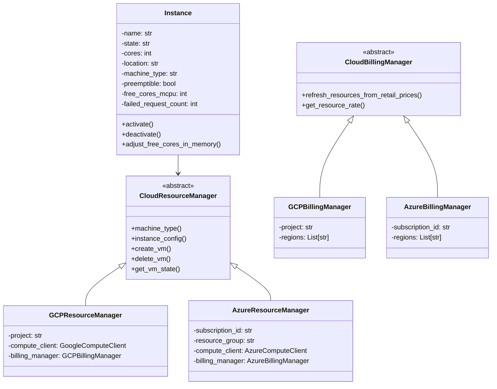
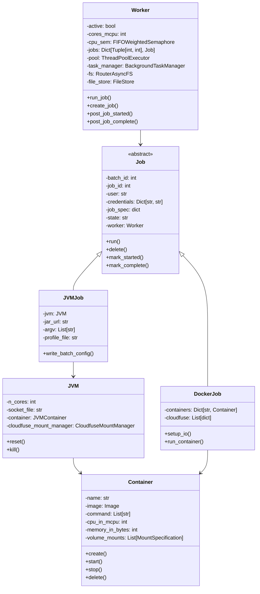
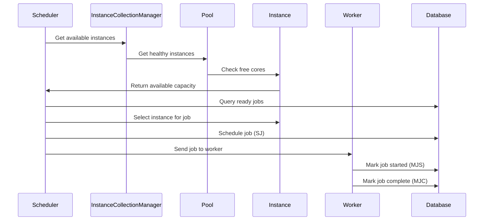
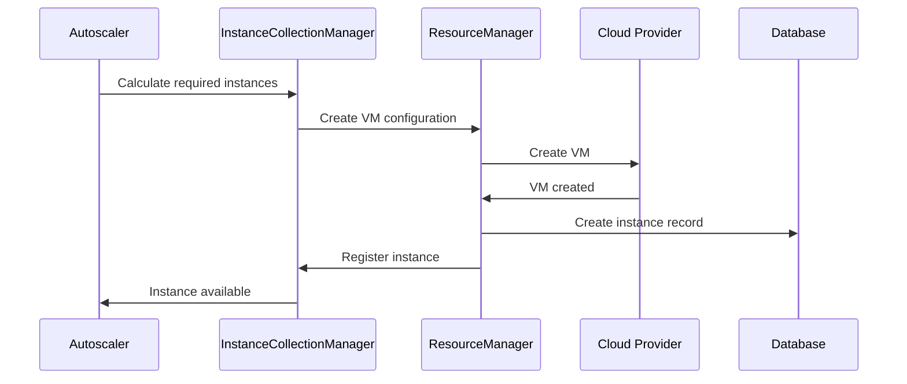
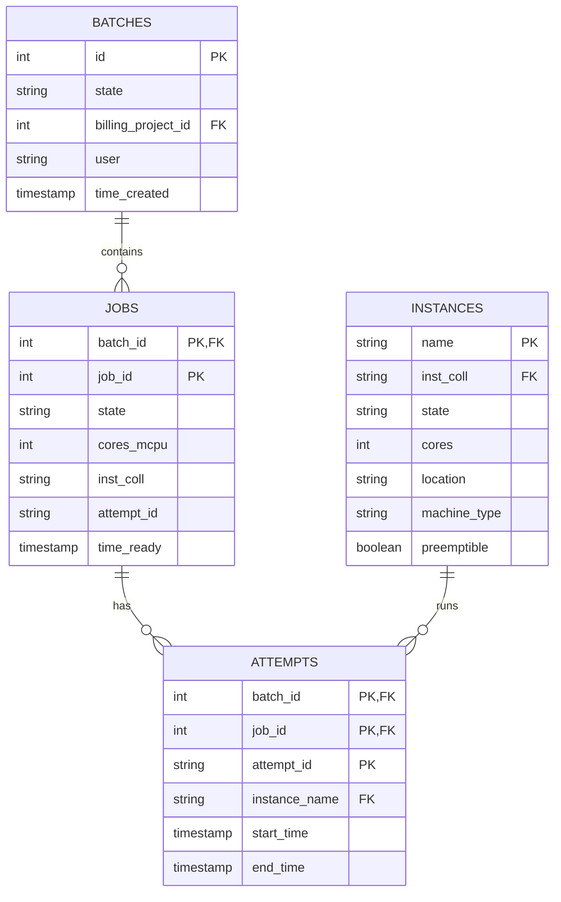
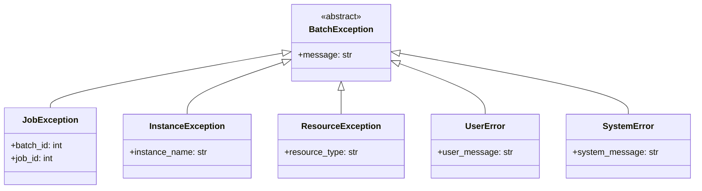
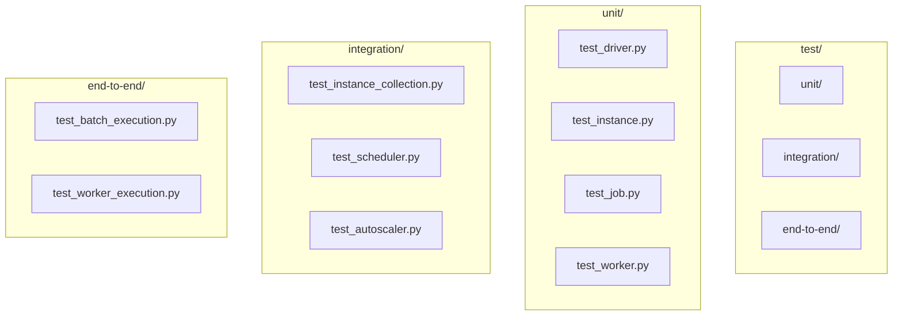

# Code Structure

This document describes the code structure of Hail Batch, including key classes, modules, and their relationships.

## Overview

The Hail Batch codebase is organized into several main packages, each responsible for different aspects of the system. The code follows a layered architecture with clear separation between cloud-specific implementations and common abstractions.

## Package Structure

```mermaid
graph TB
    subgraph "batch/"
        subgraph "batch/"
            DR[driver/]
            CL[cloud/]
            WR[worker/]
            FR[front_end/]
            UT[utils/]
        end
        
        subgraph "batch/driver/"
            DC[driver.py]
            IC[instance_collection/]
            IN[instance.py]
            JO[job.py]
            RM[resource_manager.py]
            LO[location.py]
            CA[canceller.py]
        end
        
        subgraph "batch/cloud/"
            CD[driver.py]
            subgraph "gcp/"
                GD[driver/]
                GR[resource_manager.py]
                GB[billing_manager.py]
            end
            subgraph "azure/"
                AD[driver/]
                AR[resource_manager.py]
                AB[billing_manager.py]
            end
            subgraph "terra/"
                TD[driver/]
            end
        end
        
        subgraph "batch/worker/"
            WW[worker.py]
            WJ[jvm.py]
            WC[container.py]
        end
    end
```

## Core Classes and Relationships

### Driver Layer



### Instance Collection Layer



### Instance and Resource Management



### Worker Layer



## Key Modules and Their Responsibilities

### Driver Modules

| Module | Purpose | Key Classes |
|--------|---------|-------------|
| `driver/driver.py` | Abstract cloud driver interface | `CloudDriver` |
| `driver/instance_collection/` | Instance collection management | `InstanceCollectionManager`, `Pool`, `JobPrivateInstanceManager` |
| `driver/instance.py` | Individual instance representation | `Instance` |
| `driver/job.py` | Job scheduling and state management | `schedule_job()`, `mark_job_errored()` |
| `driver/resource_manager.py` | Abstract resource management | `CloudResourceManager` |
| `driver/location.py` | Region/zone monitoring | `CloudLocationMonitor` |
| `driver/canceller.py` | Job cancellation logic | `Canceller` |

### Cloud-Specific Modules

| Cloud | Module | Purpose | Key Classes |
|-------|--------|---------|-------------|
| **GCP** | `cloud/gcp/driver/` | GCP-specific driver | `GCPDriver` |
| **GCP** | `cloud/gcp/resource_manager.py` | GCP VM management | `GCPResourceManager` |
| **GCP** | `cloud/gcp/billing_manager.py` | GCP pricing | `GCPBillingManager` |
| **Azure** | `cloud/azure/driver/` | Azure-specific driver | `AzureDriver` |
| **Azure** | `cloud/azure/resource_manager.py` | Azure VM management | `AzureResourceManager` |
| **Azure** | `cloud/azure/billing_manager.py` | Azure pricing | `AzureBillingManager` |
| **Terra** | `cloud/terra/azure/driver/` | Terra Azure driver | `TerraAzureDriver` |

### Worker Modules

| Module | Purpose | Key Classes |
|--------|---------|-------------|
| `worker/worker.py` | Main worker implementation | `Worker` |
| `worker/jvm.py` | JVM job execution | `JVM`, `JVMPool` |
| `worker/container.py` | Container management | `Container`, `Image` |

## Data Flow

### Job Scheduling Flow



### Instance Creation Flow



## Configuration Structure

### Instance Collection Configuration

```python
# Example configuration structure
class PoolConfig:
    name: str                    # Pool name (e.g., "standard")
    cloud: str                   # Cloud provider
    worker_type: str             # Machine type family
    worker_cores: int            # Cores per worker
    preemptible: bool            # Use preemptible instances
    max_instances: int           # Maximum total instances
    max_live_instances: int      # Maximum running instances
    worker_max_idle_time_secs: int  # Idle timeout
    autoscaler_loop_period_secs: int  # Autoscaler frequency
```

### Job Specification

```python
# Example job specification structure
job_spec = {
    "job_id": int,
    "batch_id": int,
    "user": str,
    "process": {
        "type": "docker" | "jvm",
        "image": str,           # For docker jobs
        "command": List[str],   # For docker jobs
        "jar_spec": dict,       # For jvm jobs
    },
    "resources": {
        "cores_mcpu": int,
        "memory_bytes": int,
        "storage_gib": int,
    },
    "regions": List[str],       # Allowed regions
    "cloudfuse": List[dict],    # Cloud storage mounts
    "secrets": List[dict],      # Kubernetes secrets
}
```

## Database Schema Overview

### Key Tables



## Error Handling Patterns

### Exception Hierarchy



## Testing Structure

### Test Organization



## Performance Considerations

### Critical Paths

1. **Scheduling Loop**: Must complete within 1 second
2. **Job State Updates**: Database operations must be fast
3. **Instance Monitoring**: Health checks every 60 seconds
4. **Autoscaler**: Runs every 15 seconds

### Bottlenecks

- **Database locks**: Concurrent job scheduling
- **Cloud API limits**: VM creation rate limits
- **Network latency**: Worker-to-driver communication
- **Resource contention**: CPU/memory allocation

## Extension Points

### Adding New Cloud Providers

1. Implement `CloudDriver` interface
2. Create cloud-specific `ResourceManager`
3. Create cloud-specific `BillingManager`
4. Add configuration support
5. Update factory functions

### Adding New Job Types

1. Extend `Job` base class
2. Implement job-specific execution logic
3. Add worker support for new job type
4. Update job specification schema
5. Add tests for new job type 