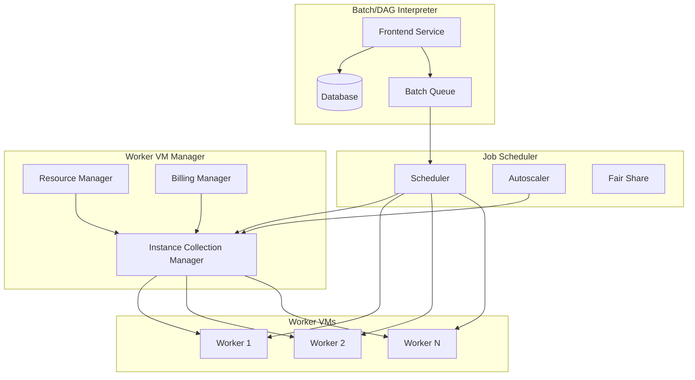
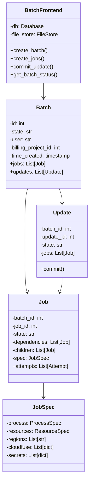
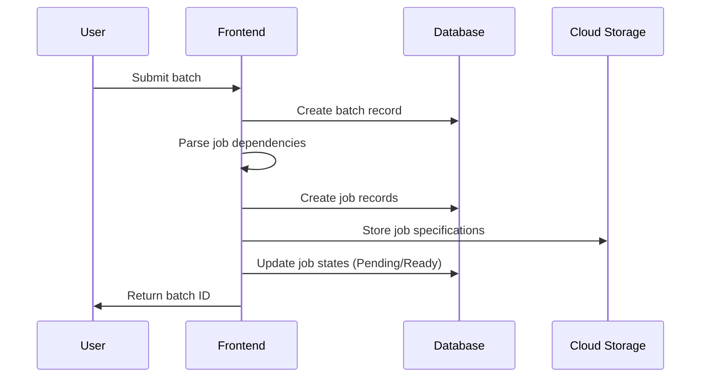
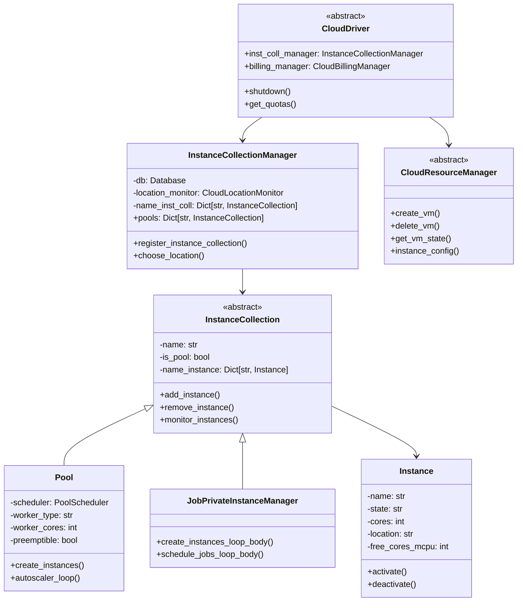
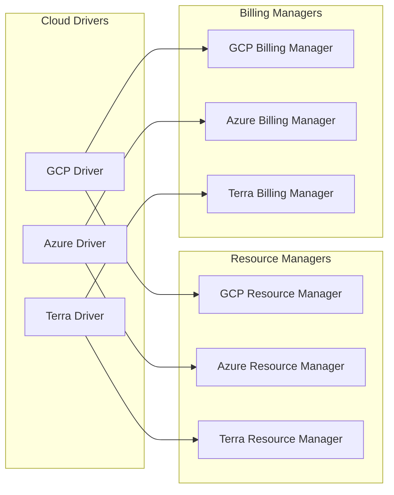
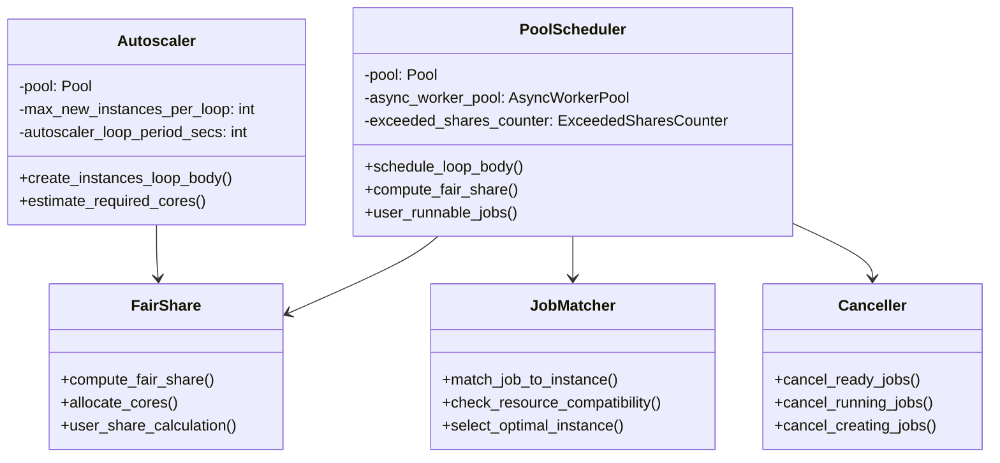
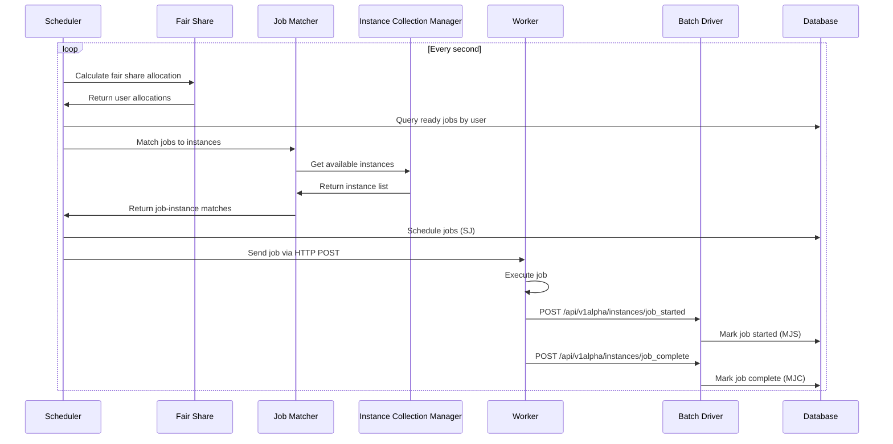
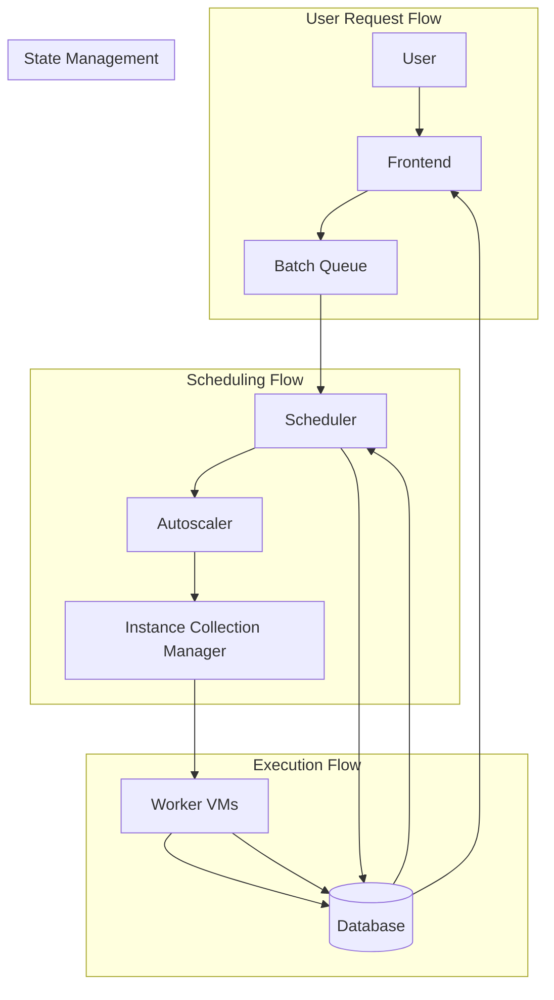
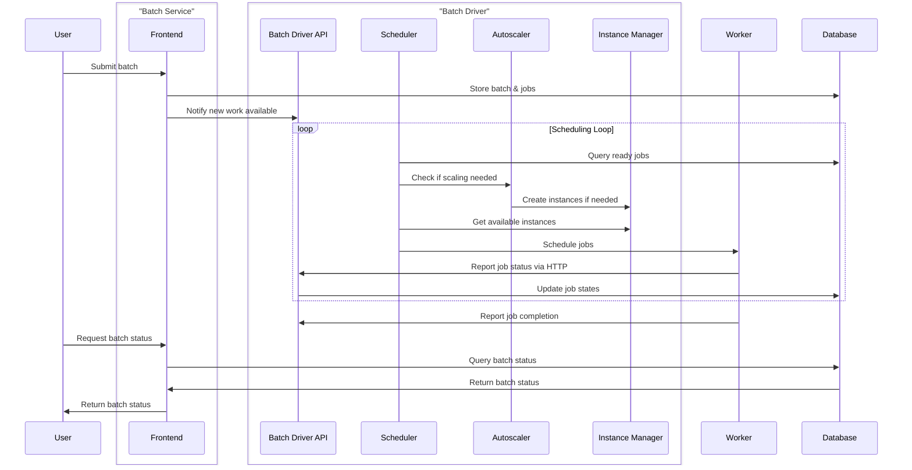

# Code Structure

This document describes the code structure of Hail Batch, organized around its three major components: the batch/DAG interpreter, worker VM manager, and job scheduler.

## Overview

Hail Batch is built around three core components that work together to execute batch workloads:

1. **Batch/DAG Interpreter** - Parses and manages job dependencies and batch lifecycle
2. **Worker VM Manager** - Provisions, manages, and monitors worker VMs across cloud providers
3. **Job Scheduler** - Matches jobs to available workers and manages execution

## Architecture Overview

## Component 1: Batch/DAG Interpreter

### Purpose
The batch/DAG interpreter is responsible for:
- Parsing user-submitted batch specifications
- Managing job dependencies and DAG execution
- Tracking batch and job state transitions
- Providing user interfaces (REST API and Web UI)

### Key Classes and Modules

### Code Location
- **Main module**: `batch/front_end/`
- **Key files**:
  - `front_end.py` - Main frontend service
  - `query/` - Database query logic
  - `templates/` - Web UI templates

### Data Flow

## Component 2: Worker VM Manager

### Purpose
The worker VM manager is responsible for:
- Provisioning and managing worker VMs across cloud providers
- Monitoring VM health and performance
- Managing VM lifecycle (create, scale, terminate)
- Abstracting cloud-specific details

### Key Classes and Modules

### Code Location
- **Main module**: `batch/driver/`
- **Key files**:
  - `driver/driver.py` - Abstract cloud driver interface
  - `driver/instance_collection/` - Instance collection management
  - `driver/instance.py` - Individual instance representation
  - `driver/resource_manager.py` - Abstract resource management
  - `cloud/` - Cloud-specific implementations

### Cloud Provider Support

## Component 3: Job Scheduler

### Purpose
The job scheduler is responsible for:
- Matching ready jobs to available worker VMs
- Implementing fair share resource allocation
- Managing job state transitions
- Coordinating with the autoscaler

### Key Classes and Modules

### Code Location
- **Main module**: `batch/driver/instance_collection/`
- **Key files**:
  - `pool.py` - Pool scheduler implementation
  - `job_private.py` - Job private instance manager
  - `base.py` - Base instance collection logic

### Scheduling Flow

## How the Components Work Together

### High-Level Interaction

### Data Flow Between Components

## Key Interfaces Between Components

### 1. Frontend ↔ Scheduler
- **Batch creation notifications** - Frontend notifies scheduler of new work
- **Job state queries** - Scheduler queries for ready jobs
- **Batch status updates** - Scheduler updates batch completion status

### 2. Scheduler ↔ Instance Manager
- **Instance availability** - Scheduler requests available instances
- **Instance creation** - Scheduler triggers autoscaler for new instances
- **Resource allocation** - Scheduler updates instance resource usage

### 3. Instance Manager ↔ Workers
- **Job assignment** - Instance manager sends jobs to workers
- **Health monitoring** - Workers report status to instance manager
- **Resource tracking** - Workers report resource usage

## Configuration and Extension Points

### Adding New Cloud Providers
1. Implement `CloudDriver` interface
2. Create cloud-specific `ResourceManager`
3. Create cloud-specific `BillingManager`
4. Update factory functions in `cloud/driver.py`

### Adding New Job Types
1. Extend `Job` base class in worker
2. Implement job-specific execution logic
3. Update job specification schema
4. Add scheduler support for new job type

### Modifying Scheduling Logic
1. Extend `PoolScheduler` or create new scheduler
2. Implement custom fair share algorithm
3. Update job matching logic
4. Add new autoscaling policies

## Performance Considerations

### Critical Paths
- **Scheduling loop**: Must complete within 1 second
- **Job state updates**: Database operations must be fast
- **Instance monitoring**: Health checks every 60 seconds
- **Autoscaler**: Runs every 15 seconds

### Bottlenecks
- **Database locks**: Concurrent job scheduling
- **Cloud API limits**: VM creation rate limits
- **Network latency**: Worker-to-driver communication
- **Resource contention**: CPU/memory allocation

## Testing Strategy

### Component Testing
- **Frontend**: API endpoint testing, batch creation flows
- **Scheduler**: Fair share algorithm, job matching logic
- **Instance Manager**: VM lifecycle, health monitoring

### Integration Testing
- **End-to-end**: Complete batch execution flows
- **Cross-component**: Scheduler-instance manager interaction
- **Cloud-specific**: Provider-specific functionality

### Performance Testing
- **Scheduling rate**: Jobs per second throughput
- **Scalability**: Large batch handling
- **Resource efficiency**: VM utilization optimization 