# Job Execution

This document describes how Hail Batch executes jobs, including the scheduling process, job-to-VM matching, execution flow, and state management.

## Overview

Job execution in Hail Batch involves multiple components working together to schedule, match, and execute jobs on worker VMs. The system supports both Docker jobs (user-defined containers) and JVM jobs (for Hail Query on Batch).

## Job Execution Architecture

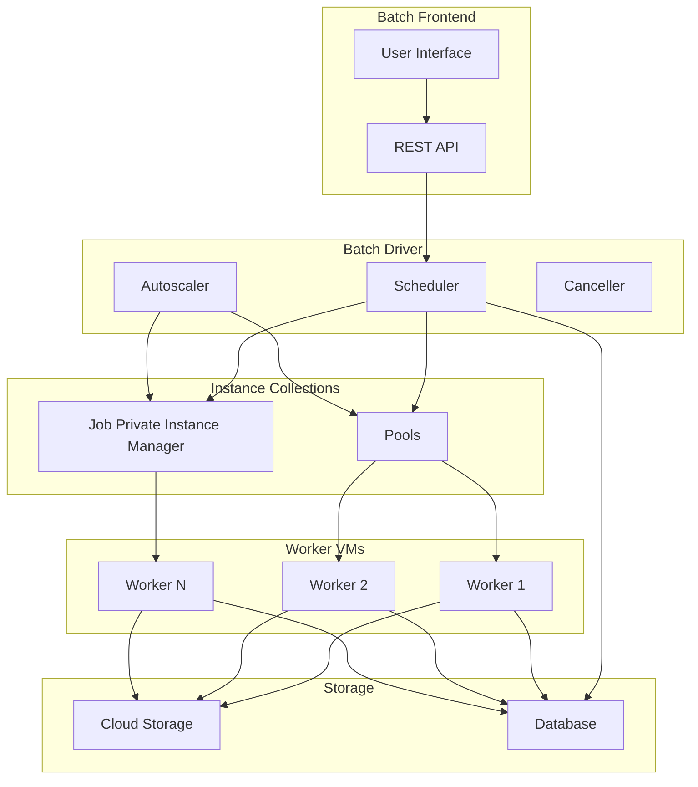

## Job Lifecycle

### Job States

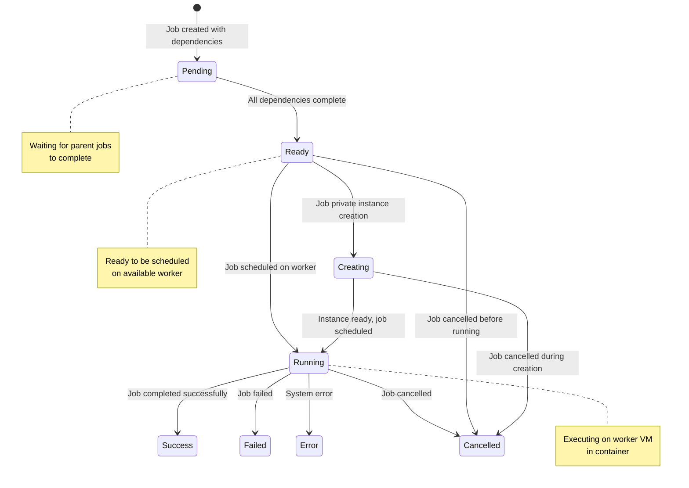

## Scheduling Process

### Scheduler Overview

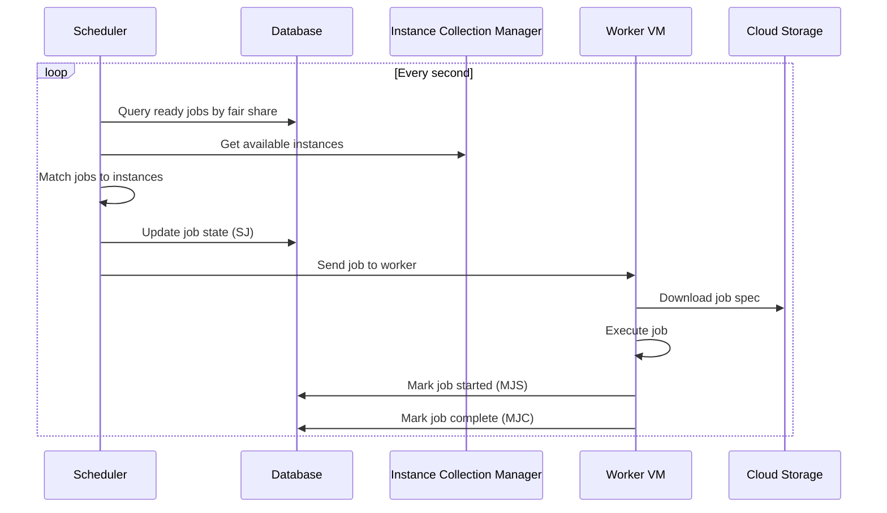

### Fair Share Scheduling

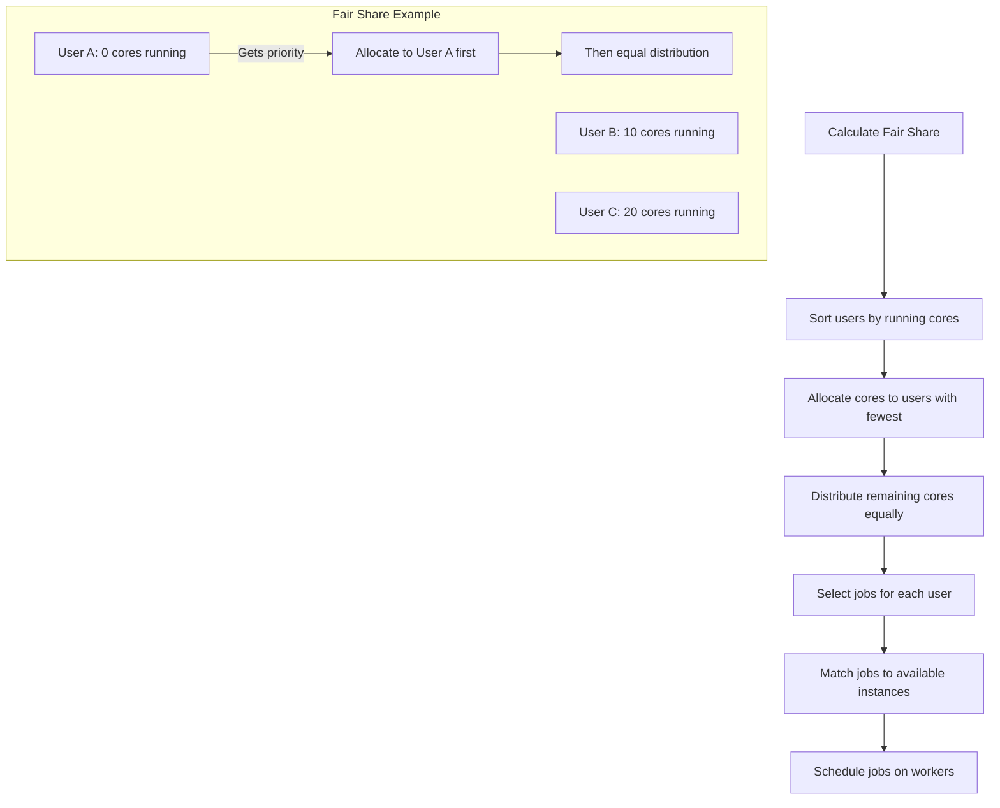

## Job-to-VM Matching

### Matching Algorithm

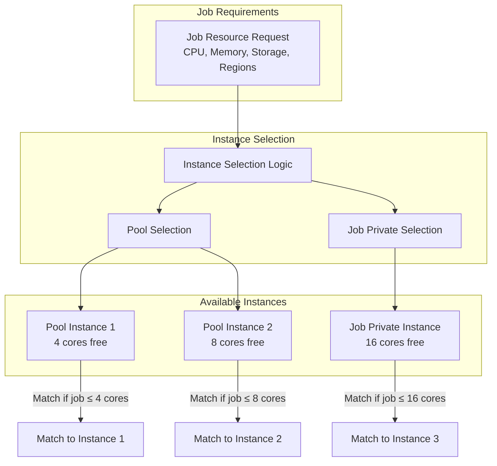

### Resource Matching Logic

The job-to-VM matching process follows these steps:

1. **Resource Requirements Check**
   - CPU cores (in mCPU units)
   - Memory (in bytes)
   - Storage (in GiB)
   - Region constraints

2. **Instance Type Selection**
   - **Pool instances**: For standard resource requirements
   - **Job private instances**: For specific machine types or large resource needs

3. **Instance Selection**
   - Find instances with sufficient free resources
   - Prefer instances in requested regions
   - Consider instance health and performance

## Job Execution Flow

### Docker Job Execution

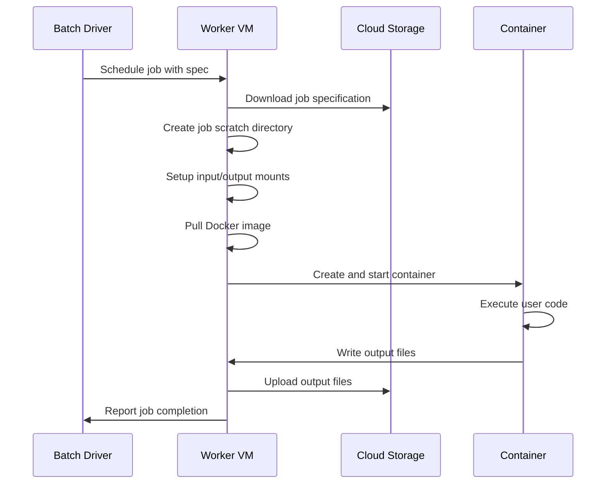

### JVM Job Execution

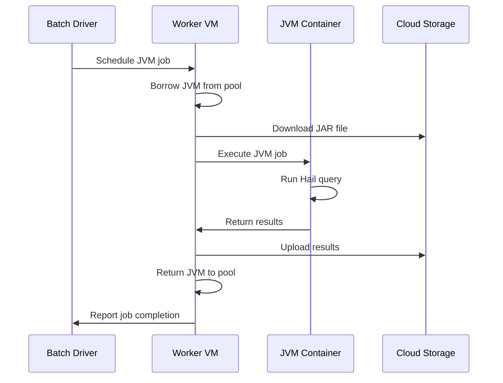

## Container Management

### Container Types

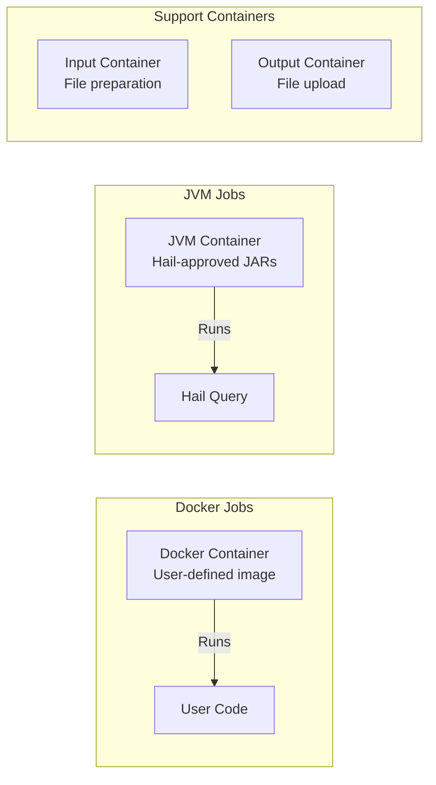

### Container Lifecycle

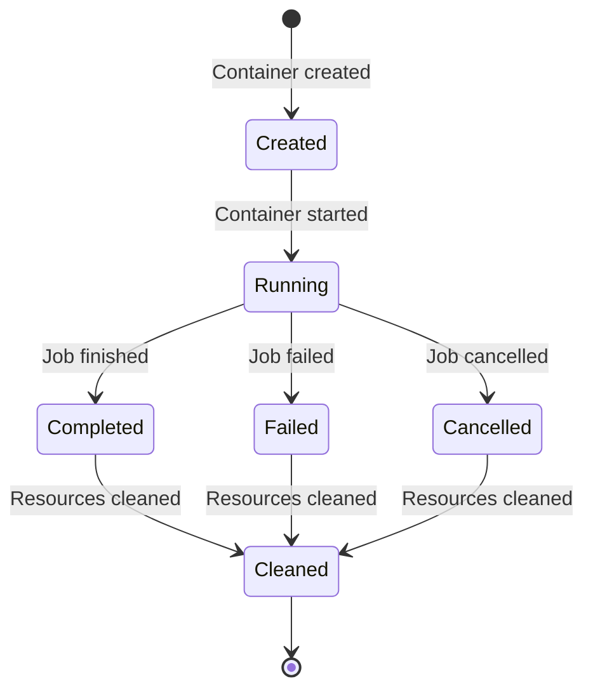

## Network Isolation

### Network Namespaces

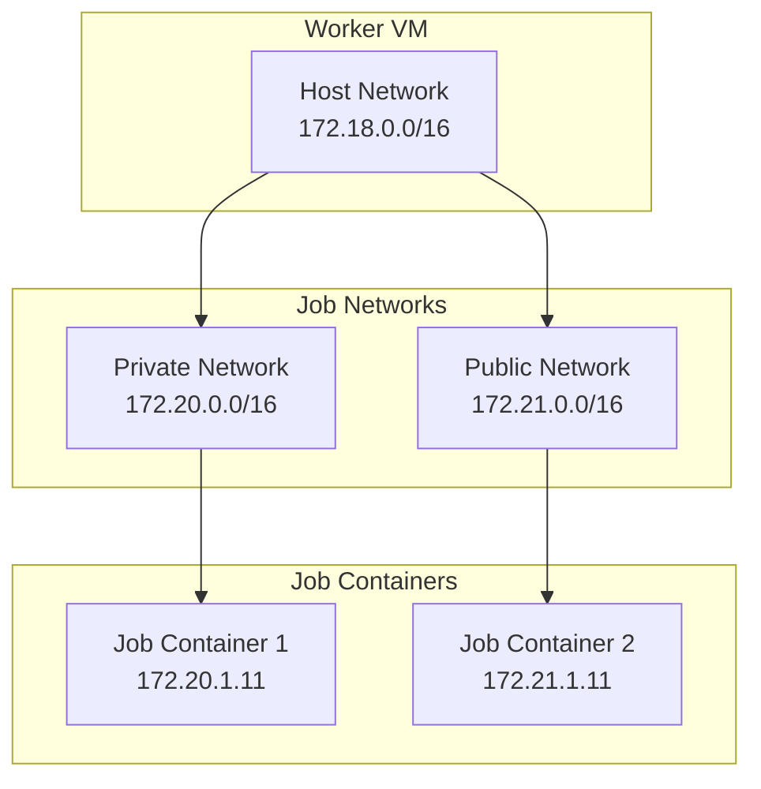

### Network Configuration

- **Private jobs**: Access to internal services, metadata server
- **Public jobs**: Internet access, restricted internal access
- **Network isolation**: Each job gets its own network namespace
- **IP masquerading**: Outbound traffic appears to come from host

## Resource Management

### Storage Management

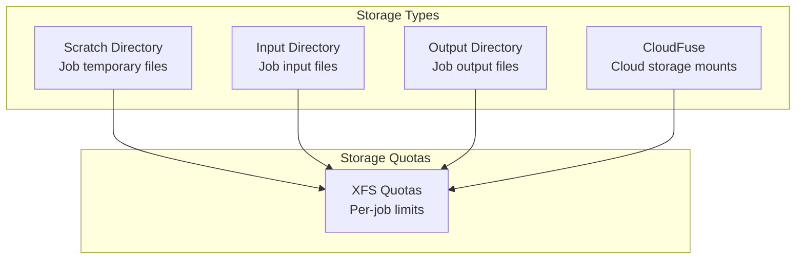

### CPU and Memory Management

- **CPU semaphores**: Ensure jobs don't exceed allocated cores
- **Memory limits**: Container memory limits based on job specification
- **Resource monitoring**: Real-time tracking of resource usage
- **OOM handling**: Automatic job termination on memory exhaustion

## Job State Updates

### State Update Operations

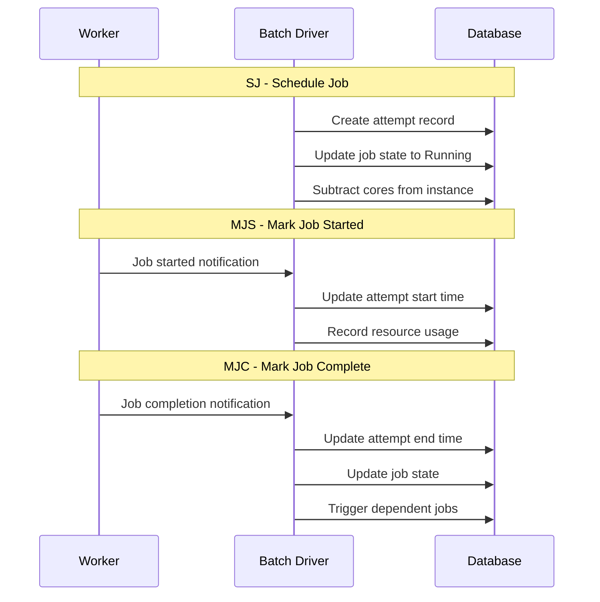

### Database Operations

The three main job state update operations:

1. **SJ (Schedule Job)**
   - Creates attempt record
   - Updates job state to "Running"
   - Subtracts allocated cores from instance

2. **MJS (Mark Job Started)**
   - Updates attempt start time
   - Records initial resource usage
   - Triggers billing calculations

3. **MJC (Mark Job Complete)**
   - Updates attempt end time
   - Sets final job state
   - Triggers dependent job scheduling
   - Updates batch completion status

## Error Handling

### Failure Scenarios

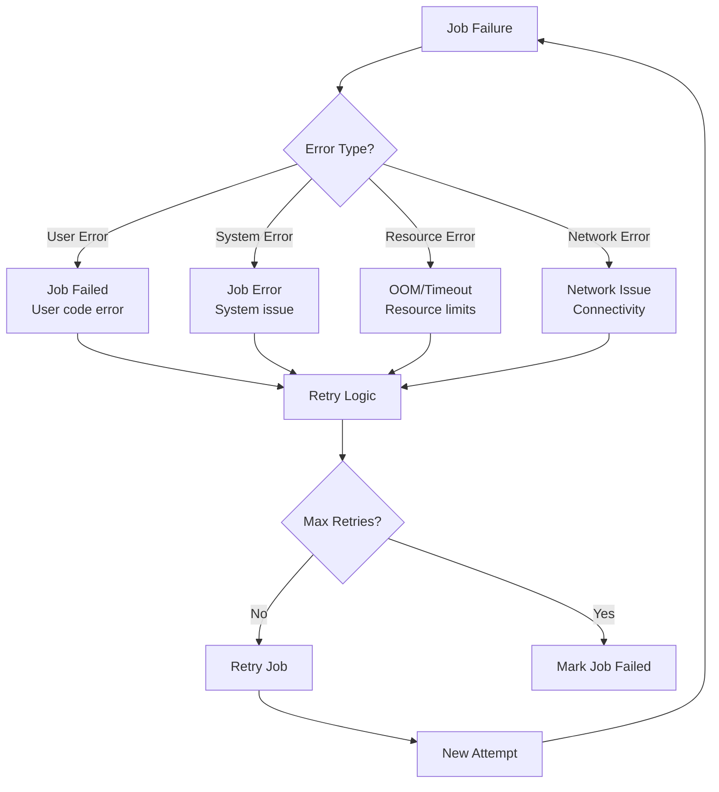

### Retry Logic

- **User errors**: No retries (user code issues)
- **System errors**: Automatic retries with exponential backoff
- **Resource errors**: Retry on different instance if possible
- **Network errors**: Retry with network reconfiguration

## Performance Considerations

### Scheduling Performance

- **Target**: 80+ jobs per second scheduling rate
- **Optimizations**: Database indexing, connection pooling
- **Bottlenecks**: Database locks, network latency

### Execution Performance

- **Container startup**: Optimized image layers, caching
- **File I/O**: Local SSD storage, parallel uploads
- **Network**: Optimized routing, connection reuse

## Monitoring and Observability

### Metrics

- **Scheduling rate**: Jobs scheduled per second
- **Execution time**: Job runtime distribution
- **Resource utilization**: CPU, memory, storage usage
- **Error rates**: Failure rates by error type

### Logging

- **Worker logs**: Container execution logs
- **Driver logs**: Scheduling and management logs
- **Application logs**: User application output
- **System logs**: Infrastructure and network logs 