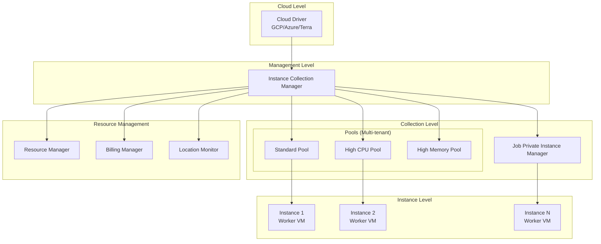
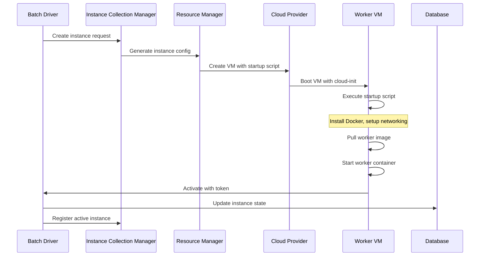
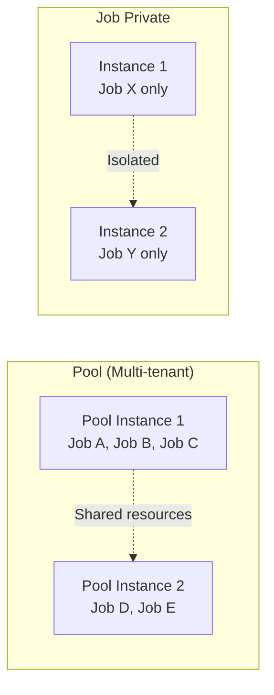
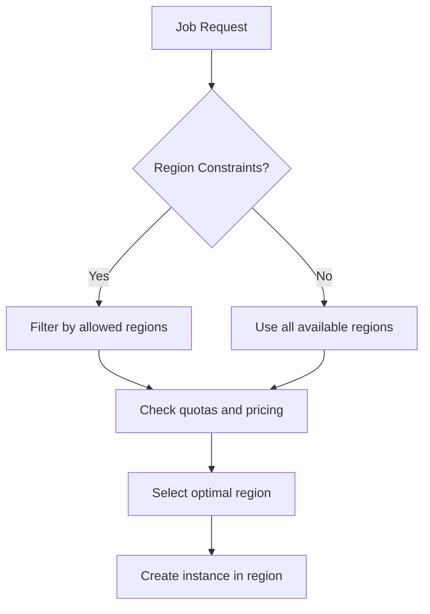
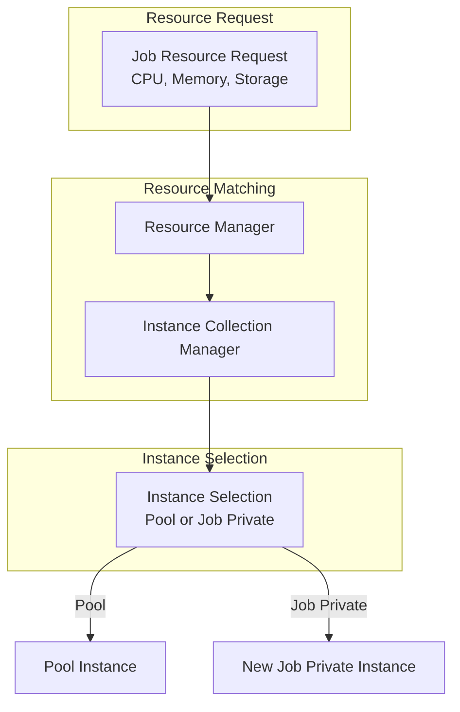
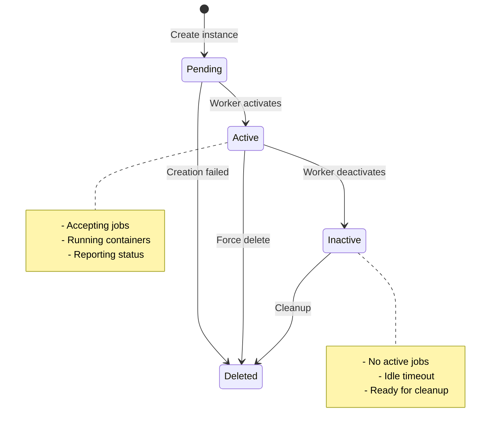
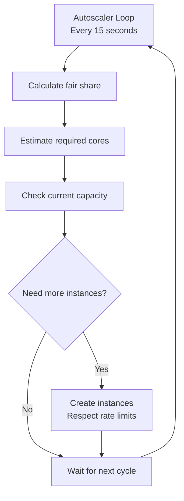

# Worker Management

This document describes how Hail Batch manages worker VMs, including their hierarchy, initialization, lifecycle, and resource management.

## Overview

Worker management in Hail Batch follows a hierarchical structure that abstracts cloud-specific details while providing unified management across different cloud providers (GCP, Azure, Terra).

## Architecture Hierarchy



## Worker VM Initialization

### Startup Process



### Startup Script Components

The startup script performs several key operations:

1. **System Setup**
   - Install Docker and dependencies
   - Configure networking (iptables rules)
   - Setup data disks and mount points

2. **Worker Container Launch**
   - Pull the batch worker image
   - Create and start the worker container
   - Pass environment variables and configuration

3. **Activation**
   - Contact the batch driver with activation token
   - Register as available for job scheduling

## Instance Collections

### Pool Types

Hail Batch maintains three main pool types, each optimized for different workloads:

| Pool Type | Memory/Core | Use Case | Machine Types |
|-----------|-------------|----------|---------------|
| **highcpu** | ~1GB/core | CPU-intensive workloads | n1-highcpu-* |
| **standard** | ~4GB/core | General purpose | n1-standard-* |
| **highmem** | ~8GB/core | Memory-intensive workloads | n1-highmem-* |

### Pool vs Job Private



**Pool Instances:**
- Multiple jobs can run on the same VM
- Resource sharing and isolation via containers
- Cost-effective for small to medium jobs
- Automatic scaling based on demand

**Job Private Instances:**
- One VM per job
- Full resource isolation
- Used for specific machine type requirements
- Common for jobs requiring >16 cores or special configurations

## Resource Management

### Location Selection



### Resource Allocation



## Instance Lifecycle

### State Transitions



### Monitoring and Health Checks

The batch driver continuously monitors instance health:

- **Heartbeat monitoring**: Workers report status every minute
- **Failed request tracking**: Instances with repeated failures are marked unhealthy
- **Automatic cleanup**: Inactive instances are automatically deleted
- **Preemption handling**: Preempted instances are detected and jobs rescheduled

## Configuration

### Instance Collection Configuration

```yaml
# Example pool configuration
pools:
  standard:
    worker_type: "standard"
    worker_cores: 16
    preemptible: true
    max_instances: 1000
    max_live_instances: 500
    worker_max_idle_time_secs: 300
    autoscaler_loop_period_secs: 15
    max_new_instances_per_autoscaler_loop: 10
```

### Cloud-Specific Configuration

Each cloud provider has specific configuration requirements:

- **GCP**: Project, zones, machine types, service accounts
- **Azure**: Subscription, resource groups, regions, service principals  
- **Terra**: Workspace configuration, resource IDs

## Scaling and Autoscaling

### Autoscaler Logic



### Fair Share Algorithm

The autoscaler uses a fair share algorithm to prevent resource starvation:

1. Sort users by current running cores (ascending)
2. Allocate cores to users with fewest running cores first
3. Distribute remaining cores equally among users
4. Scale up instances based on fair share allocation

## Troubleshooting

### Common Issues

1. **Instance Creation Failures**
   - Cloud provider quotas exceeded
   - Invalid machine type or region
   - Network configuration issues

2. **Worker Activation Failures**
   - Startup script errors
   - Docker image pull failures
   - Network connectivity issues

3. **Resource Allocation Issues**
   - Insufficient capacity in desired regions
   - Job requirements exceed available instance types
   - Fair share algorithm bottlenecks

### Debugging Tools

- **Batch Driver UI**: Real-time view of instance states and statistics
- **Worker Logs**: Detailed logs from worker VMs
- **Cloud Provider Logs**: VM creation and management logs
- **Database Queries**: Instance and job state tracking 